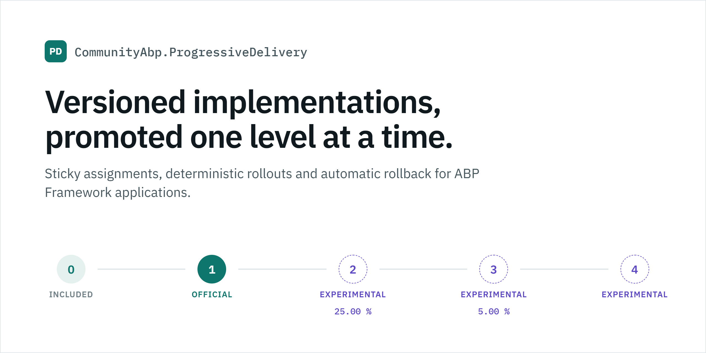
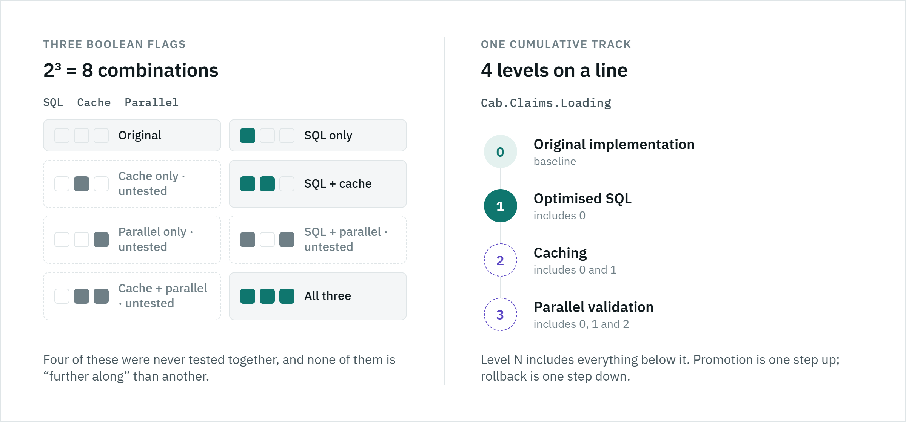
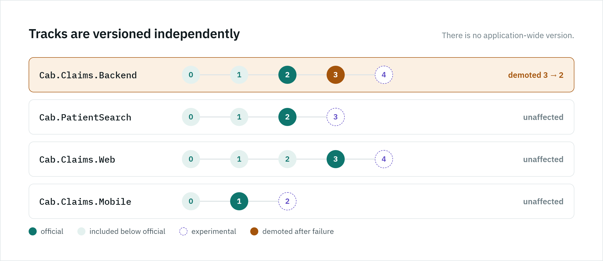
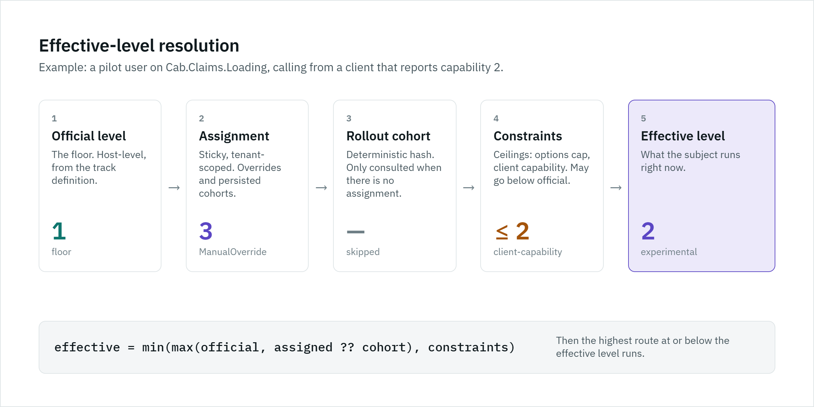
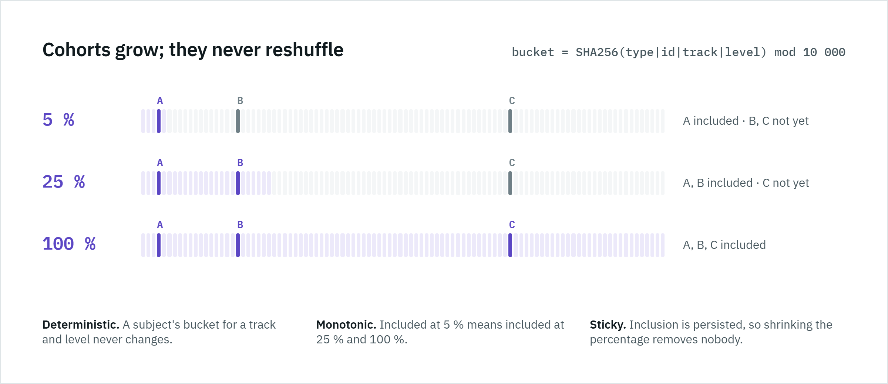
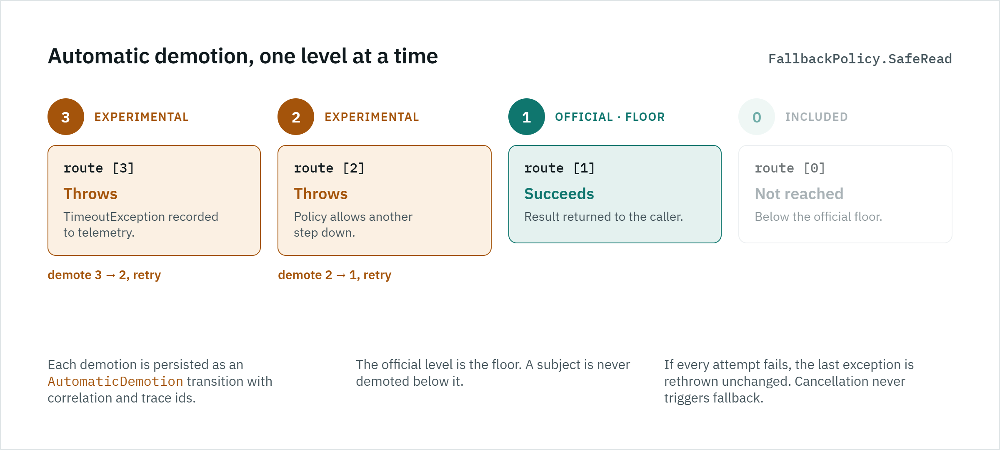
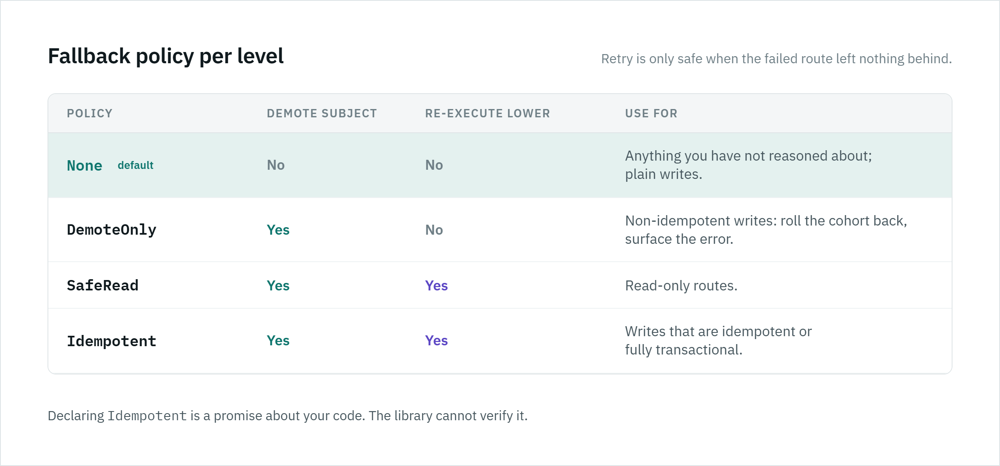
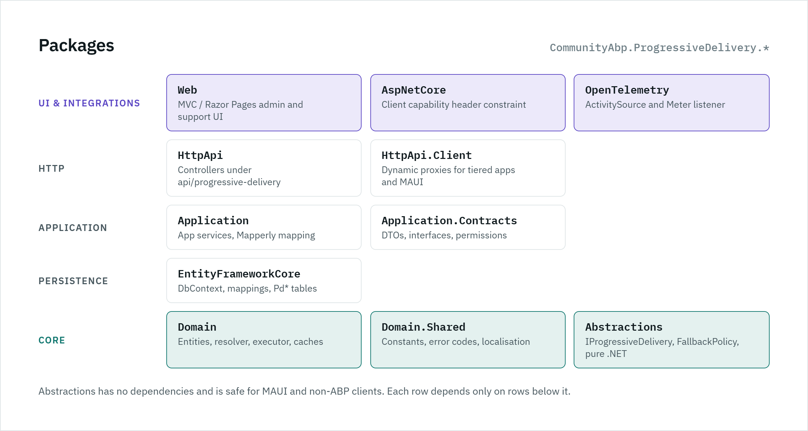

# CommunityAbp.ProgressiveDelivery

<picture>
  <source media="(prefers-color-scheme: dark)" srcset="docs/images/hero-dark.png">
  
</picture>

[](https://github.com/kfrancis/CommunityAbp.ProgressiveDelivery/actions/workflows/build.yml)
[](https://www.nuget.org/packages/CommunityAbp.ProgressiveDelivery.Domain)
[](LICENSE)

An [ABP Framework](https://abp.io) module for safely and observably moving subjects (users, tenants, clients) through
**versioned implementations** of a behaviour: sticky assignments, deterministic percentage rollouts, automatic
rollback on failure, transition history, OpenTelemetry instrumentation, multi-tenancy, and support inspection.

Targets ABP 10.x on .NET 10.

- [What is Progressive Delivery?](#what-is-progressive-delivery)
- [Why integer levels instead of boolean feature flags?](#why-integer-levels-instead-of-boolean-feature-flags)
- [Feature tracks](#feature-tracks)
- [Official vs experimental levels](#official-vs-experimental-levels)
- [Quick start](#quick-start)
- [Effective-level resolution](#effective-level-resolution)
- [Sticky rollout](#sticky-rollout)
- [Automatic demotion / fallback](#automatic-demotion--fallback)
- [Safe reads vs writes](#safe-reads-vs-writes)
- [Multi-tenancy](#multi-tenancy)
- [Telemetry](#telemetry)
- [Support inspection](#support-inspection)
- [ABP Feature Management vs Progressive Delivery](#abp-feature-management-vs-progressive-delivery)
- [Architecture](#architecture)
- [Packages](#packages)
- [Permissions](#permissions)
- [Roadmap](#roadmap)
- [Contributing](#contributing)

## What is Progressive Delivery?

Progressive delivery is the practice of shipping a new implementation of something *next to* the old one and moving
traffic between them deliberately: a few subjects first, more when it holds up, everyone once it is proven, and back
again the moment it misbehaves. This module makes that a first-class, persisted, observable concept inside an ABP
application instead of a pile of `if` statements and configuration switches.

This is **not** ordinary A/B testing. There is no conversion metric and no "winner". The primary use cases are:

- progressive rollout of a rewritten code path;
- performance experiments (new query, new cache, new algorithm) against a known baseline;
- safe replacement of implementations with an automatic way back;
- controlled migration between behavioural versions of a feature;
- operational rollback without a deployment.

## Why integer levels instead of boolean feature flags?

<picture>
  <source media="(prefers-color-scheme: dark)" srcset="docs/images/levels-vs-flags-dark.png">
  
</picture>

A boolean flag answers "is X on?". Real replacements are rarely one switch. An optimised claims loader might go
through *optimised SQL*, then *plus caching*, then *plus parallel validation*. Modelling that as three independent
booleans creates 2³ combinations, most of which were never tested together, and no notion of "further along".

A **cumulative integer level** captures the real shape of the work:

| Level | `Cab.Claims.Loading`             |
|-------|----------------------------------|
| 0     | Original implementation          |
| 1     | Optimised SQL implementation     |
| 2     | Level 1 **plus** caching         |
| 3     | Level 2 **plus** parallel validation |

Level *N* includes everything below it. Moving a subject up is a promotion; moving it down is a rollback; the set of
valid states is a line, not a lattice. Rollback becomes "go one step down" and support can explain exactly what a
subject is running by listing the levels between official and effective.

## Feature tracks

<picture>
  <source media="(prefers-color-scheme: dark)" srcset="docs/images/independent-tracks-dark.png">
  
</picture>

A **FeatureTrack** is an independently versioned, promotable, observable, rollback-capable behaviour. Tracks are
deliberately independent: there is no application-wide version.

```
Cab.Claims.Backend   = 3
Cab.PatientSearch    = 2
Cab.Claims.Web       = 4
Cab.Claims.Mobile    = 1
```

A failure in `Cab.Claims.Backend` demotes subjects on that track only. `Cab.Claims.Web` never notices.

Each track has:

- `OfficialLevel` – the minimum every subject receives;
- `HighestAvailableLevel` – the highest level that exists;
- a list of **FeatureLevel** definitions (description, support description, fallback policy, performance flag);
- optional **FeatureRollout** definitions (percentage per candidate level);
- `IsEnabled` – when off, everybody gets the official level.

## Official vs experimental levels

`EffectiveLevel = max(OfficialLevel, AssignedLevel)` subject to constraints. A subject above the official level is
*experimental*.

Promoting a level to official (`OfficialLevel: 1 -> 3`) does **not** rewrite assignments. An assignment of 1 simply
resolves to 3 from now on; an assignment of 4 stays experimental. The promotion is recorded once as a
`FeatureTransition` of type `OfficialLevelChanged`. History is kept; nothing is migrated.

## Quick start

### 1. Install

```bash
dotnet add package CommunityAbp.ProgressiveDelivery.Domain
dotnet add package CommunityAbp.ProgressiveDelivery.EntityFrameworkCore
dotnet add package CommunityAbp.ProgressiveDelivery.Application
dotnet add package CommunityAbp.ProgressiveDelivery.HttpApi
dotnet add package CommunityAbp.ProgressiveDelivery.Web            # optional: MVC / Razor Pages admin + support UI
dotnet add package CommunityAbp.ProgressiveDelivery.AspNetCore     # optional: client capability header
dotnet add package CommunityAbp.ProgressiveDelivery.OpenTelemetry  # optional: traces + metrics
```

Add the module dependencies to your ABP modules (Domain → Domain, EF Core → EF Core, and so on), then map the
entities in your `DbContext`:

```csharp
protected override void OnModelCreating(ModelBuilder builder)
{
    base.OnModelCreating(builder);
    builder.ConfigureProgressiveDelivery();
}
```

and add a migration in the host (`dotnet ef migrations add AddProgressiveDelivery`). See
[docs/database.md](docs/database.md).

### 2. Define tracks

Definitions are upserted on every `IDataSeeder.SeedAsync()`: the definition (display name, description, level
descriptions, support descriptions, fallback policy, performance flag) follows code, and missing levels are
appended. Operational state (official level, enabled, rollouts, assignments) is set only at creation and afterwards
belongs to admins.

```csharp
Configure<ProgressiveDeliveryOptions>(options =>
{
    options.ApplicationName = "Cab.Api";

    options.Tracks.Add("Cab.Claims.Loading", "Claims loading")
        .WithLevel(0, "Original implementation")
        .WithLevel(1, "Optimised SQL", "Uses the new claims query.", FallbackPolicy.SafeRead)
        .WithLevel(2, "Caching", "Adds a read-through cache in front of level 1.", FallbackPolicy.SafeRead)
        .WithLevel(3, "Parallel validation", "Validates claims in parallel.", FallbackPolicy.SafeRead, isPerformanceSensitive: true)
        .WithInitialOfficialLevel(1);
});
```

Code-defined tracks are read-only in the admin API/UI apart from operational actions (new
`PUT api/progressive-delivery/tracks/{id}/enabled` for enable/disable); tracks created through the admin API/UI
remain fully editable. Removing a track from code retires it (it becomes an ordinary admin track that can then be
deleted).

### 3. Consume

```csharp
public class ClaimsAppService(IProgressiveDelivery progressiveDelivery) : ApplicationService
{
    public Task<ClaimResult> LoadAsync(Guid patientId, CancellationToken cancellationToken)
    {
        return progressiveDelivery.ExecuteAsync(
            CabFeatureTracks.ClaimsLoading,
            new ProgressiveRoutes<ClaimResult>
            {
                [0] = ct => LoadClaimsLegacyAsync(patientId, ct),
                [1] = ct => LoadClaimsOptimizedAsync(patientId, ct),
                [2] = ct => LoadClaimsOptimizedV2Async(patientId, ct),
            },
            new ProgressiveExecutionOptions { OperationName = nameof(LoadAsync) },
            cancellationToken);
    }
}
```

Routes do not have to exist for every level: the **highest route at or below the effective level** runs. A subject on
level 3 above runs route `[2]`. If no route exists at or below the effective level, `ProgressiveRouteNotFoundException`
is thrown immediately.

For simple branching without route execution:

```csharp
if (await progressiveDelivery.IsAtLeastAsync(CabFeatureTracks.ClaimsLoading, 2, ct)) { ... }
var level = await progressiveDelivery.GetEffectiveLevelAsync(CabFeatureTracks.ClaimsLoading, ct);
```

## Effective-level resolution

<picture>
  <source media="(prefers-color-scheme: dark)" srcset="docs/images/effective-level-resolution-dark.png">
  
</picture>

```
Request
   |
   v
Resolve Feature Track            (distributed cache, host-level)
   |
   v
Official Level                   floor
   |
   +---- Subject Assignment      (distributed cache, tenant-scoped, sticky)
   |
   +---- Rollout Cohort          (deterministic hash, only when no assignment)
   |
   +---- Tenant/User Constraints (IFeatureLevelConstraintProvider)
   |
   +---- Client Capability       (IFeatureLevelConstraintProvider, e.g. X-ProgressiveDelivery-Capabilities)
   |
   v
Effective Level
   |
   v
Execute Route
   |
   +---- Success -> Telemetry
   |
   +---- Failure
            |
            +---- Record telemetry
            +---- Demote if policy allows
            +---- Retry previous level
```

The pipeline lives in `IFeatureLevelResolver` and is built from replaceable services:

| Concern                  | Interface                          | Default                                   |
|--------------------------|------------------------------------|-------------------------------------------|
| Who is the subject?      | `IFeatureSubjectResolver`          | current user in current tenant            |
| Finding subjects (admin) | `IFeatureSubjectLookupProvider`    | users via ABP user lookup; tenants via `ITenantStore`; clients via the OpenIddict package |
| Sticky assignment store  | `IFeatureAssignmentCache` + repo   | ABP distributed cache over EF Core        |
| Track definitions        | `IFeatureTrackDefinitionCache`     | ABP distributed cache over EF Core        |
| Cohort membership        | `IRolloutCohortAllocator`          | SHA-256 stable hash, 10 000 buckets       |
| Upper bounds             | `IFeatureLevelConstraintProvider`  | options-based caps; HTTP capability header|
| Rollout growth           | `IRolloutPolicy`                   | manual (always `Hold`)                    |

Constraints are ceilings and may go **below** the official level; that is how an emergency cap
(`ProgressiveDeliveryOptions.LevelCaps["Cab.Claims.Loading"] = 1`, bindable from configuration) rolls everyone back
without a deployment. The intended precedence, top wins:

```
Emergency restriction  (constraint)
Explicit user override (assignment: ManualOverride / EmergencyOverride)
Tenant override        (constraint or assignment, see roadmap)
Sticky assignment      (assignment)
Rollout cohort         (deterministic)
Official level         (floor)
```

Unknown tracks resolve to level 0 with a warning by default (`UnknownTrackBehavior.UseLevelZero`); switch to
`Throw` to fail fast.

## Sticky rollout

<picture>
  <source media="(prefers-color-scheme: dark)" srcset="docs/images/sticky-rollout-dark.png">
  
</picture>

A `FeatureRollout` targets one level with a percentage in basis points (100 = 1 %). Membership is
`SHA256(subjectType | subjectId | track | level) mod 10000 < percentage`: deterministic, platform independent, and
**monotonic** — a subject included at 5 % is still included at 25 % and 100 %. Nothing is randomised per request.

- Intermediate levels are never skipped: to reach level 3 via rollout a subject must also be in the level-2 cohort,
  unless the rollout sets `AllowSkippingIntermediateLevels`.
- Cohort inclusion is persisted as a sticky assignment (`AutomaticPromotion`) so history, demotion and support
  inspection all work. Disable with `PersistRolloutAssignments = false`.
- Pausing a rollout stops new inclusions and keeps existing assignments.
- Promoting the target level to official completes the rollout.

## Automatic demotion / fallback

<picture>
  <source media="(prefers-color-scheme: dark)" srcset="docs/images/automatic-demotion-dark.png">
  
</picture>

When a route throws, the runtime looks at the **fallback policy of the failing level** (or the per-call override):

```
Level 3 fails
    |
    v
record failure (telemetry, log)
    |
    v
demote subject to level 2       (persisted assignment + FeatureTransition, own unit of work)
    |
    v
execute level 2                 (only for SafeRead / Idempotent)
```

and repeats — 3 → 2 → 1 → 0 — until a route succeeds or the floor is reached. The floor is the official level
(a subject is never demoted below it; if a constraint already placed the subject below official, the floor is that
level). When every attempt fails the **last exception is rethrown unchanged**, with diagnostics attached to
`Exception.Data` (`progressive_delivery.track`, `.level`, `.attempted_levels`, `.previous_failures`, ...).

Every demotion records a `FeatureTransition` with `CorrelationId`, `TraceId`, tenant, exception type, application
and operation name. Demotions are persisted in their own unit of work *after* the caller's unit of work completes
(see [ADR 0007](docs/adr/0007-deferred-side-effect-writes.md)), so they survive a failing request and never contend
with its transaction. Support can correlate an incident by track, level, subject and trace.

Cancellation never triggers fallback.

## Safe reads vs writes

<picture>
  <source media="(prefers-color-scheme: dark)" srcset="docs/images/fallback-policies-dark.png">
  
</picture>

Automatic fallback re-executes a *lower* implementation after a *higher* one threw. That is only safe when the failed
route left nothing behind. Consider:

```
Route B (level 2) performs a write
Route B throws after the write
Route A (level 1) re-executes the write
```

The write now happened twice — duplicated or corrupted data. So fallback safety is explicit per level:

| `FallbackPolicy` | Demote subject | Re-execute lower route | Use for                                             |
|------------------|----------------|------------------------|-----------------------------------------------------|
| `None` (default) | no             | no                     | anything you have not reasoned about; plain writes  |
| `DemoteOnly`     | yes            | no                     | non-idempotent writes: roll the cohort back, surface the error |
| `SafeRead`       | yes            | yes                    | read-only routes                                    |
| `Idempotent`     | yes            | yes                    | writes that are idempotent or fully transactional   |

**The safe default is no retry.** Declaring `Idempotent` is a promise you make about your code; the library cannot
verify it.

## Multi-tenancy

- Tracks, levels and rollouts are **host-level** definitions shared by all tenants (cache items are marked
  `[IgnoreMultiTenancy]`).
- Assignments and transitions are **tenant-scoped** (`IMultiTenant`); the subject carries its `TenantId` and every
  read/write runs inside `CurrentTenant.Change(subject.TenantId)`. Cache keys are tenant-prefixed by ABP.
- A tenant caller of the management API is confined to its own tenant; only the host may target another tenant.
- Host-level subjects (`TenantId = null`) are supported, so "everyone in the host" and "user X in tenant Y" coexist.

## Telemetry

The core has no telemetry dependency. `IProgressiveDeliveryTelemetry` is a fan-out listener interface; register as
many as you like. `CommunityAbp.ProgressiveDelivery.OpenTelemetry` provides one built on `ActivitySource` and `Meter`:

```csharp
// ABP module
[DependsOn(typeof(ProgressiveDeliveryOpenTelemetryModule))]

// OpenTelemetry pipeline
builder.Services.AddOpenTelemetry()
    .WithTracing(t => t.AddProgressiveDeliveryInstrumentation())
    .WithMetrics(m => m.AddProgressiveDeliveryInstrumentation());
```

Activity `progressive_delivery.execute` tags: `progressive_delivery.track`, `.level`, `.official_level`,
`.highest_available_level`, `.experimental`, `.fallback_policy`, `.subject_type`, `.application`, `.operation`,
`.success`, `.fallback`, `.from_level`, `.to_level`, `.error_type`. Exceptions are recorded as events. Subject ids are
**not** emitted unless `ProgressiveDeliveryOpenTelemetryOptions.IncludeSubjectId` is set.

Metrics (meter `CommunityAbp.ProgressiveDelivery`): `progressive_delivery.execution.duration` (histogram, seconds),
`progressive_delivery.execution.count`, `progressive_delivery.execution.errors`, `progressive_delivery.fallback.count`,
`progressive_delivery.demotion.count`, `progressive_delivery.assignment.count`, `progressive_delivery.transition.count`.

A Sentry (or any other) integration implements the same interface; no Sentry types exist in this repository.

## Support inspection

`GET api/progressive-delivery/inspection/subject?trackName=…&subjectType=User&subjectId=…` returns:

```json
{
  "track": "Cab.Claims.Loading",
  "officialLevel": 1,
  "assignedLevel": 3,
  "effectiveLevel": 3,
  "experimental": true,
  "constraints": [],
  "differences": [
    { "level": 2, "description": "Caching", "supportDescription": "Adds a read-through cache in front of level 1." },
    { "level": 3, "description": "Parallel validation", "supportDescription": "Validates claims in parallel." }
  ]
}
```

`differences` always contains **every** level in `(OfficialLevel, EffectiveLevel]`, so support sees the complete
delta even when several experimental levels are stacked. Inspection is read-only (it never persists cohort
assignments) and requires `ProgressiveDelivery.Assignments.View`. `…/inspection/subject/all` inspects every track.

Lightweight clients call `POST api/progressive-delivery/client/resolve` with their supported levels and receive the
effective level per track for the calling user (authentication only, no permission).

## Admin and support UI

`CommunityAbp.ProgressiveDelivery.Web` is a standard ABP MVC UI module: add `[DependsOn(typeof(ProgressiveDeliveryWebModule))]`
to your Web module and a *Progressive Delivery* group appears in the main menu (permission-gated). It depends only on the
application contracts, so it works in tiered deployments with `ProgressiveDeliveryHttpApiClientModule`.

| Page | Route | Permission |
|------|-------|------------|
| Tracks overview (KPIs, table, create/edit/delete) | `/ProgressiveDelivery/Tracks` | `ProgressiveDelivery.Tracks` (+ `.Manage` to change) |
| Track detail: level line, levels, rollouts, assignments, history, danger zone | `/ProgressiveDelivery/Tracks/Detail?id=` | per tab: `Levels.Manage`, `Rollouts`, `Assignments.View`, `Telemetry` |
| Subject inspection (differences, constraints, override / reset) | `/ProgressiveDelivery/Inspection` | `ProgressiveDelivery.Assignments.View` (+ `.Override`) |
| Transition history | `/ProgressiveDelivery/Transitions` | `ProgressiveDelivery.Telemetry` |

Mutating controls are hidden without the matching permission; support staff with `Assignments.View` get a read-only view.
Tracks defined in code carry a *Defined in code* badge and expose only operational controls (official level,
enable/disable, rollouts, overrides); editing, adding levels and deleting are hidden and rejected by the API
([ADR 0008](docs/adr/0008-code-owns-track-definitions.md)).
Styling uses the active theme's Bootstrap variables (Basic and LeptonX). The design source lives in
[docs/design](docs/design).

### Finding subjects without pasting ids

The override modal, the inspection page and the transition history filter pick subjects with a search box instead of an id field:

- **Users** by user name, name or email (or a pasted id), through ABP's `IExternalUserLookupServiceProvider`. The
  Identity module registers one in process (the Identity HTTP API client does in tiered apps); with neither, user
  ids have to be typed.
- **Tenants** by name, through `ITenantStore` (Tenant Management, or the configuration store). Tenant callers only
  ever see their own tenant. Hosts also get a tenant picker to target a user inside a tenant.
- **Clients** by client id or display name from the OpenIddict applications, with the optional
  `CommunityAbp.ProgressiveDelivery.OpenIddict` package: add `[DependsOn(typeof(ProgressiveDeliveryOpenIddictModule))]`
  to the host that runs the application layer (it needs the OpenIddict repositories, so the auth server or a host
  sharing its database). Display names are matched in memory over the first 1 000 applications.
- **Any type**, including custom types, from ids that already have assignments. Any typed value can still be used
  as the id.

Assignment and transition listings show the subject's name next to its id (`SubjectDisplayName` on the DTOs).
The API is `GET api/progressive-delivery/subjects/{types|search|find}` (`IFeatureSubjectLookupAppService`,
`Assignments.View`, `Assignments.Override` or `Telemetry`). To make another subject type searchable, register an
`IFeatureSubjectLookupProvider`:

```csharp
[ExposeServices(typeof(IFeatureSubjectLookupProvider))]
public class DeviceSubjectLookupProvider : IFeatureSubjectLookupProvider, ITransientDependency
{
    public string SubjectType => "Device";

    public Task<IReadOnlyList<FeatureSubjectLookupItem>> SearchAsync(string? filter, int maxResultCount, CancellationToken ct = default)
        => /* query your device registry by name or serial number */;

    public Task<FeatureSubjectLookupItem?> FindAsync(string subjectId, CancellationToken ct = default)
        => /* display name for one device id */;
}
```

Providers run inside the subject's tenant (ambient `ICurrentTenant`).

## Sample host

`sample/` contains an Aspire-orchestrated ABP MVC host with seeded tracks, dev personas (ops / support) and an
execution playground. See [sample/README.md](sample/README.md).

```bash
dotnet run --project sample/CommunityAbp.ProgressiveDelivery.Sample.AppHost --launch-profile http
```

## ABP Feature Management vs Progressive Delivery

| Question                                              | Answered by            |
|-------------------------------------------------------|------------------------|
| Is this capability available to this tenant/edition?  | ABP Feature Management |
| Which implementation/version of it should this subject receive right now? | Progressive Delivery |

They compose: check the ABP feature first, then execute through `IProgressiveDelivery`. Nothing here replaces or
wraps `IFeatureChecker`.

## Architecture

<picture>
  <source media="(prefers-color-scheme: dark)" srcset="docs/images/architecture-dark.png">
  
</picture>

```
Abstractions ──────────────┐   pure .NET: IProgressiveDelivery, FallbackPolicy, FeatureSubject,
                           │   IFeatureLevelResolver, IFeatureLevelConstraintProvider, IRolloutPolicy,
                           │   IProgressiveDeliveryTelemetry  (safe for MAUI / non-ABP clients)
Domain.Shared ─────────────┤   constants, error codes, localisation
Domain ────────────────────┤   entities, managers, resolver, executor, caches, seeding
Application.Contracts ─────┤   DTOs, app service interfaces, permissions
Application ───────────────┤   app services (Mapperly mapping)
EntityFrameworkCore ───────┤   DbContext, mappings, repositories
HttpApi ───────────────────┤   controllers under api/progressive-delivery
HttpApi.Client ────────────┤   dynamic client proxies (tiered apps, MAUI)
Web ───────────────────────┤   MVC / Razor Pages admin + support UI (ABP UI module: menu contributor, permissions, embedded pages)
AspNetCore ────────────────┤   X-ProgressiveDelivery-Capabilities constraint provider
OpenTelemetry ─────────────┘   ActivitySource + Meter listener
```

Persistence (`Pd` table prefix):

| Table                 | Purpose                                                        |
|-----------------------|----------------------------------------------------------------|
| `PdFeatureTracks`     | track definitions (unique `Name`; `IsDefinedInCode` marker)    |
| `PdFeatureLevels`     | cumulative levels per track (unique `FeatureTrackId + Level`)  |
| `PdFeatureRollouts`   | percentage rollouts per target level                           |
| `PdFeatureAssignments`| sticky `subject + track -> level` (unique per tenant)          |
| `PdFeatureTransitions`| durable state changes with correlation/trace ids               |

There is deliberately **no request telemetry table**; per-execution data goes to OpenTelemetry.

Design decisions are recorded in [docs/adr](docs/adr).

## Packages

| Package | Depends on |
|---------|------------|
| `CommunityAbp.ProgressiveDelivery.Abstractions` | nothing |
| `CommunityAbp.ProgressiveDelivery.Domain.Shared` | Abstractions, `Volo.Abp.Validation` |
| `CommunityAbp.ProgressiveDelivery.Domain` | Domain.Shared, `Volo.Abp.Ddd.Domain`, `Volo.Abp.Caching`, `Volo.Abp.Users.Domain` |
| `CommunityAbp.ProgressiveDelivery.Application.Contracts` | Domain.Shared, `Volo.Abp.Ddd.Application.Contracts`, `Volo.Abp.Authorization.Abstractions` |
| `CommunityAbp.ProgressiveDelivery.Application` | Domain, Application.Contracts, `Volo.Abp.Ddd.Application`, `Volo.Abp.Mapperly` |
| `CommunityAbp.ProgressiveDelivery.EntityFrameworkCore` | Domain, `Volo.Abp.EntityFrameworkCore` |
| `CommunityAbp.ProgressiveDelivery.HttpApi` | Application.Contracts, `Volo.Abp.AspNetCore.Mvc` |
| `CommunityAbp.ProgressiveDelivery.HttpApi.Client` | Application.Contracts, `Volo.Abp.Http.Client` |
| `CommunityAbp.ProgressiveDelivery.Web` | Application.Contracts, `Volo.Abp.AspNetCore.Mvc.UI.Theme.Shared` |
| `CommunityAbp.ProgressiveDelivery.AspNetCore` | Domain, `Volo.Abp.AspNetCore` |
| `CommunityAbp.ProgressiveDelivery.OpenTelemetry` | Abstractions, `Volo.Abp.Core`, `OpenTelemetry.Api` |
| `CommunityAbp.ProgressiveDelivery.OpenIddict` (optional) | Domain, `Volo.Abp.OpenIddict.Domain` |

## Permissions

```
ProgressiveDelivery.Tracks
ProgressiveDelivery.Tracks.Manage
ProgressiveDelivery.Levels
ProgressiveDelivery.Levels.Manage
ProgressiveDelivery.Assignments
ProgressiveDelivery.Assignments.View
ProgressiveDelivery.Assignments.Override
ProgressiveDelivery.Rollouts
ProgressiveDelivery.Rollouts.Manage
ProgressiveDelivery.Telemetry          (transition history)
```

Support staff with `Assignments.View` can inspect without being able to change rollout state.

## Upgrading

The module ships no EF Core migrations, so schema changes need a migration in the host. Breaking or
behaviour-changing upgrades are listed here.

### Code-defined tracks (`IsDefinedInCode`)

- **Schema:** new non-nullable column `PdFeatureTracks.IsDefinedInCode`. Add a host migration, for example
  `dotnet ef migrations add AddFeatureTrackIsDefinedInCode`. Existing rows default to `false` (admin-managed) until
  the next seed adopts the tracks still listed in `ProgressiveDeliveryOptions.Tracks`.
- **Behaviour:** seeding now upserts code-defined definitions (display name, description, level fields), and the
  admin API rejects definition changes to those tracks with `ProgressiveDelivery:TrackDefinedInCode`. Enable/disable
  moves to `PUT api/progressive-delivery/tracks/{id}/enabled`. `UpdateAsync` still works when the text is unchanged.
- **Validation:** invalid definitions (duplicate, non-contiguous or negative levels, out-of-range
  `InitialOfficialLevel`) now throw at startup instead of partially seeding.
- **`InitialOfficialLevel`:** applied only when a track is created. It no longer re-promotes a track an admin has
  demoted to level 0.
- **API:** `ProgressiveDeliveryDataSeedContributor`'s constructor takes an `IGuidGenerator`; subclasses must pass it
  through.
- **Sample host:** it builds its schema with `EnsureCreated`, so delete `progressive-delivery-sample.db` to pick up
  the new column.

See [ADR 0008](docs/adr/0008-code-owns-track-definitions.md) and [docs/database.md](docs/database.md#seeding).

### Subject lookup

- **Dependency:** the Domain package now depends on `Volo.Abp.Users.Domain` (for `IExternalUserLookupServiceProvider`).
  Client lookup is opt-in through the new `CommunityAbp.ProgressiveDelivery.OpenIddict` package.
  No schema change.
- **API:** `IFeatureAssignmentRepository` gained `GetSubjectIdsAsync`; custom repository implementations must add it.
  `FeatureAssignmentDto` and `FeatureTransitionDto` gained `SubjectDisplayName`.
- **Behaviour:** when the host overrides a `Tenant` subject from the UI, the assignment is now stored inside that
  tenant, matching `FeatureSubject.Tenant(id)`. Previously the UI stored it as a host-level subject that the runtime
  never resolved.

## Roadmap

- Performance-aware rollout growth: an `IRolloutPolicy` fed by p50/p95/error-rate/fallback-rate observations with
  minimum sample counts and observation windows, driven by a background worker. The abstractions and domain model
  are in place; no naive "average is lower, therefore promote" logic will ship.
- Tenant-scoped rollouts and tenant maximum levels as first-class entities (today: constraint providers).
- Blazor UI (`CommunityAbp.ProgressiveDelivery.Blazor`) mirroring the MVC pages.
- `CommunityAbp.ProgressiveDelivery.Sentry` implementing `IProgressiveDeliveryTelemetry`.
- Client SDK for .NET MAUI: `IProgressiveDelivery` over `HttpApi.Client` with local capability constraints.
- Shadow execution (run the candidate, return the official result, compare).
- Automatic global promotion when a rollout reaches 100 % and holds.

## Contributing

See [CONTRIBUTING.md](CONTRIBUTING.md). Build and test:

```bash
dotnet build
dotnet test
```

## License

MIT — see [LICENSE](LICENSE).
